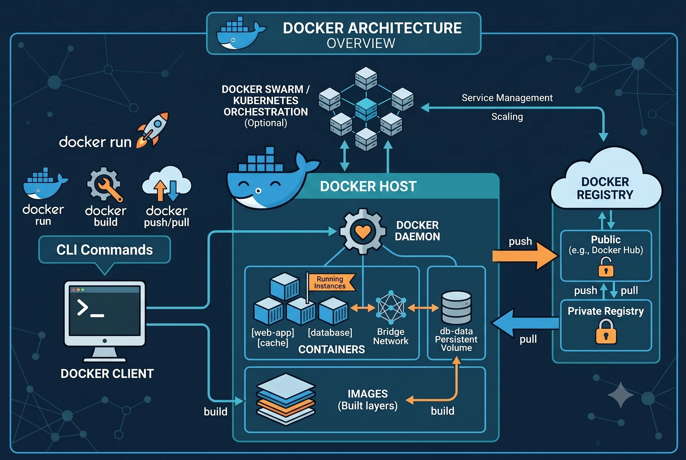

# Docker Architecture

This document describes the high-level Docker architecture and container structure used in this project.

## Overview

Briefly describe how the containers interact with each other and the host system.

## Architecture

## Container Diagram

*(Optional: Insert a diagram or ASCII art here)*

## Service Breakdown

| Service Name | Base Image | Ports | Purpose |
| :--- | :--- | :--- | :--- |
| **web-app** | `node:18-alpine` | `3000:3000` | Frontend/Backend application |
| **database** | `postgres:15` | `5432:5432` | Persistent data storage |

## Volumes & Persistency

* **`db_data`**: Named volume mapping to `/var/lib/postgresql/data` to ensure database persistence.

## Networks

* **`app_network`**: Custom bridge network facilitating isolated communication between services.
