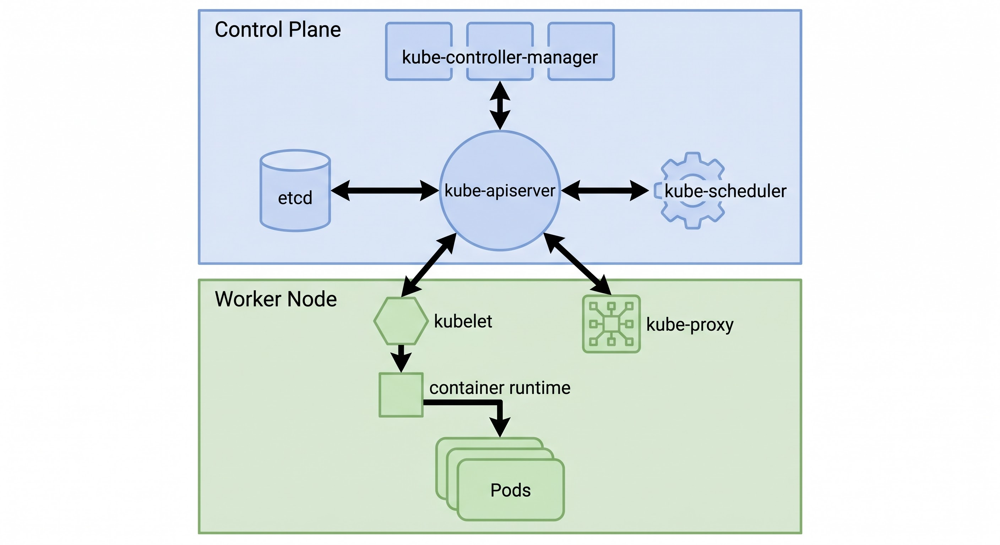

# ☸️ Kubernetes (K8s) Architecture & Concepts Guide

A concise and structured reference guide explaining the Kubernetes Cluster Architecture, core components, and operational workflow.

---

## 📌 Architecture Overview

Kubernetes operates on a **Master-Worker (Control Plane - Node)** model:

* **Control Plane (Master Node):** The decision-maker. Manages cluster state, scheduling, and overall orchestrations.
* **Worker Nodes:** The execution unit. Hosts application containers inside Pods and handles networking.


---

## 🧠 Control Plane (Master Node)

The Control Plane monitors the cluster and ensures the actual state matches the desired state.

| Component | Description |
| :--- | :--- |
| **`kube-apiserver`** | The main entryway/gateway for all cluster management (`kubectl`, REST APIs, Web UI). |
| **`etcd`** | A distributed, highly available key-value store holding all cluster data and state configuration. |
| **`kube-scheduler`** | Assigns unscheduled Pods to the best available Worker Node based on resource constraints. |
| **`kube-controller-manager`** | Runs background controller loops (e.g., Node Controller, ReplicaSet Controller) to maintain cluster health. |

---

## ⚙️ Worker Node Components

Worker Nodes carry out instructions from the Control Plane and run actual user applications.

| Component | Description |
| :--- | :--- |
| **`kubelet`** | The node agent that ensures containers defined in PodSpecs are running and healthy. |
| **`kube-proxy`** | The network router on each node that maintains network rules and enables Pod-to-Pod communication. |
| **Container Runtime** | The underlying software that executes containers (e.g., `containerd`, `CRI-O`). |
| **Pod** | The smallest deployable unit in Kubernetes, containing one or more containers sharing network/storage. |

---

## 🔄 Deployment Workflow

```text
  [ User / kubectl ]
          │
          ▼
   [ kube-apiserver ] <─────── Writes/Reads ───────> [ etcd ]
          │
     ┌────┴────────────────────────┬────────────────────────┐
     ▼                             ▼                        ▼
[ kube-scheduler ]    [ kube-controller-manager ]     [ Worker Node ]
(Selects best node)       (Maintains state)                 │
                                                            ▼
                                                        [ kubelet ]
                                                            │
                                                            ▼
                                                 [ Container Runtime ]
                                                            │
                                                            ▼
                                                  [ Running Pods ]

```

---

## 🛠️ Key Objects & Concepts

* **Deployment:** Defines application updates, scaling, and rollbacks.
* **Service:** Provides a stable IP address and DNS name to expose Pods internally or externally.
* **ConfigMap / Secret:** Manages configuration data and sensitive credentials separately from application code.
* **Namespace:** Virtual clusters used to isolate resources within the same physical cluster.

---

## 🚀 Basic Cheat Sheet (`kubectl`)

```bash
# Check cluster information
kubectl cluster-info

# View all running nodes
kubectl get nodes

# Get all running pods in the current namespace
kubectl get pods

# Create a deployment from a manifest
kubectl apply -f deployment.yaml

# Inspect logs of a specific pod
kubectl logs <pod-name>

```

---
