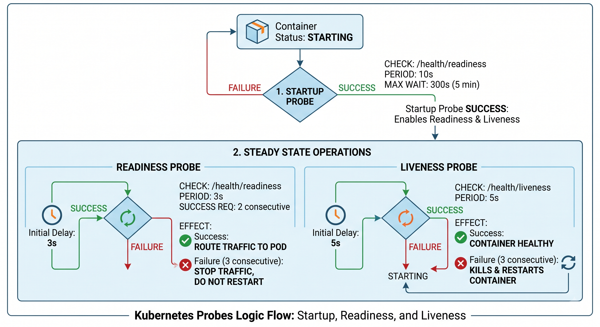

# Kubernetes Probes Configuration Guide

This repository contains the Kubernetes Deployment configuration featuring **Startup**, **Readiness**, and **Liveness** probes for the Node.js application (`sachinthokal/k8s_probes_app:v1`).


---

## 🛠 Deployment Manifest (`deployment.yaml`)

```yaml
kind: Deployment
apiVersion: apps/v1
metadata:
  name: probs-deployment
  namespace: probs-ns
spec:
  replicas: 1
  selector:
    matchLabels:
      app: probs-app
  template:
    metadata:
      labels:
        app: probs-app
    spec:
      containers:
        - name: probs-container
          image: sachinthokal/k8s_probes_app:v1
          ports:
            - containerPort: 3000
          
          # 1. STARTUP PROBE
          startupProbe:
            httpGet:
              path: /health/readiness
              port: 3000
            periodSeconds: 10
            failureThreshold: 30
          
          # 2. READINESS PROBE
          readinessProbe:
            httpGet:
              path: /health/readiness
              port: 3000
            initialDelaySeconds: 3
            periodSeconds: 3
            failureThreshold: 3
            timeoutSeconds: 2
            successThreshold: 2

          # 3. LIVENESS PROBE
          livenessProbe:
            httpGet:
              path: /health/liveness
              port: 3000
            initialDelaySeconds: 5
            periodSeconds: 5
            failureThreshold: 3
            timeoutSeconds: 2
            successThreshold: 1

```

---

## 🔍 How Probes Work in This Configuration

### 1. `startupProbe` (Boot-up Protection)

* **Goal:** Gives the application time to perform initial startup (e.g., loading cache, DB connections).
* **Behavior:** Checks `http://<pod-ip>:3000/health/readiness` every **10 seconds** (`periodSeconds`).
* **Max Timeout:** Allows up to **30 failures** (`failureThreshold`). `10s × 30 = 300 seconds (5 minutes)`.
* **Key Rule:** Both **Readiness** and **Liveness** probes remain **DISABLED** until the Startup probe succeeds.

---

### 2. `readinessProbe` (Traffic Routing)

* **Goal:** Determines if the Pod is ready to accept incoming user network traffic.
* **Behavior:** Starts 3 seconds after the startup probe succeeds (`initialDelaySeconds`), checking `/health/readiness` every **3 seconds** (`periodSeconds`).
* **Timeout:** Expects an HTTP response within **2 seconds** (`timeoutSeconds`).
* **Success Rule:** Requires **2 consecutive successful checks** (`successThreshold: 2`) before marking the Pod as `READY`.
* **Failure Rule:** If it fails **3 consecutive times** (`failureThreshold: 3`), Kubernetes **stops routing traffic** to this Pod (Removes it from Service Endpoints). The container is **NOT restarted**.

---

### 3. `livenessProbe` (Container Health & Auto-Healing)

* **Goal:** Detects if the application is deadlocked or frozen and needs a restart.
* **Behavior:** Starts 5 seconds after the startup probe succeeds (`initialDelaySeconds`), checking `/health/liveness` every **5 seconds** (`periodSeconds`).
* **Timeout:** Expects an HTTP response within **2 seconds** (`timeoutSeconds`).
* **Success Rule:** Marks healthy on **1 successful response** (`successThreshold: 1`).
* **Failure Rule:** If it fails **3 consecutive times** (`failureThreshold: 3`), Kubernetes considers the container dead and **KILLS & RESTARTS** the container automatically.

---

## 🚀 How to Deploy and Verify

### 1. Create Namespace & Deploy

```bash
kubectl create namespace probs-ns
kubectl apply -f deployment.yaml

```

### 2. Check Deployment Status

```bash
kubectl get pods -n probs-ns -w

```

### 3. Inspect Probe Events & Logs

```bash
# Detailed events and probe failures
kubectl describe pod <pod-name> -n probs-ns

# Stream real-time logs
kubectl logs -f deployment/probs-deployment -n probs-ns

```