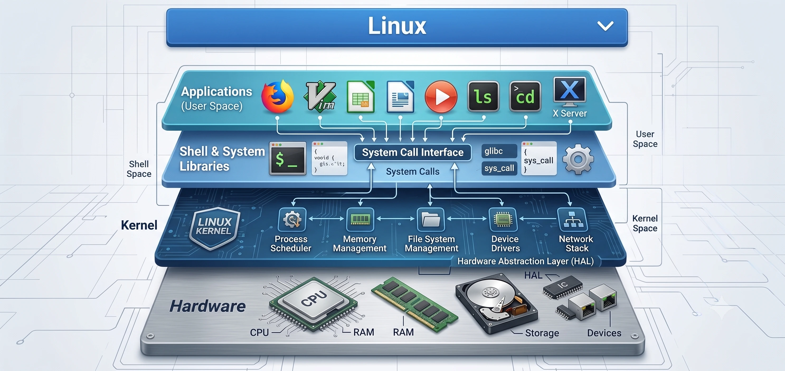
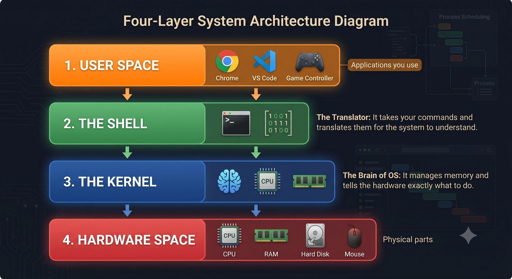

# Linux Architecture

## Overview

Linux architecture is the structural layout of a Linux operating system. It defines how different parts of the system talk to each other and work together.

## Architecture

## Components

The Linux system is divided into four major layers:

1. **Hardware**:
   This is the physical part of the computer. It includes your CPU, RAM, hard disk, and other connected devices.

2. **Kernel**:
   The core of the operating system. It directly talks to the hardware. It manages memory, CPU tasks, and disk storage.

3. **Shell**:
   An interface between the user and the kernel. It takes commands from the user, interprets them, and sends them to the kernel to execute.

4. **Applications (User Space)**:
   The programs or software that you run on Linux. Examples include web browsers, text editors, and media players.

